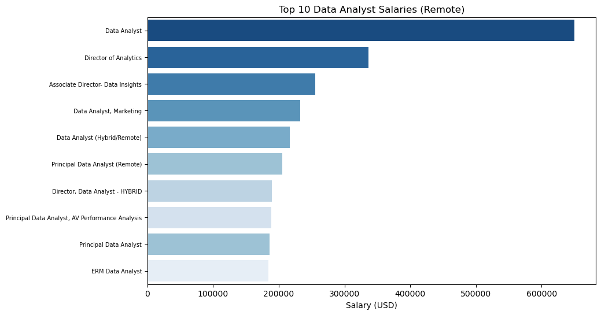
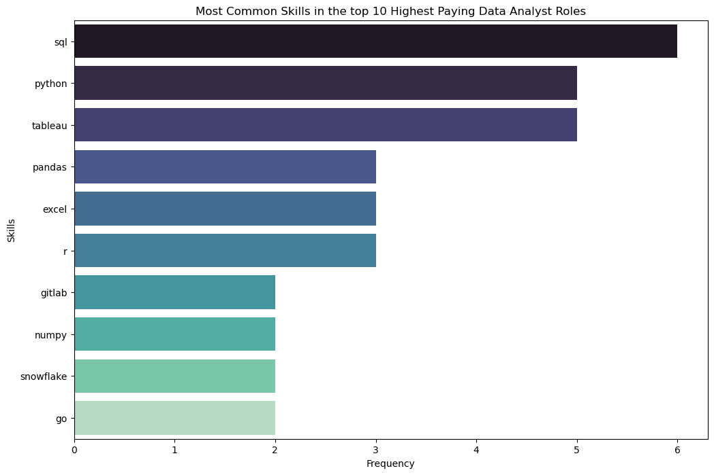
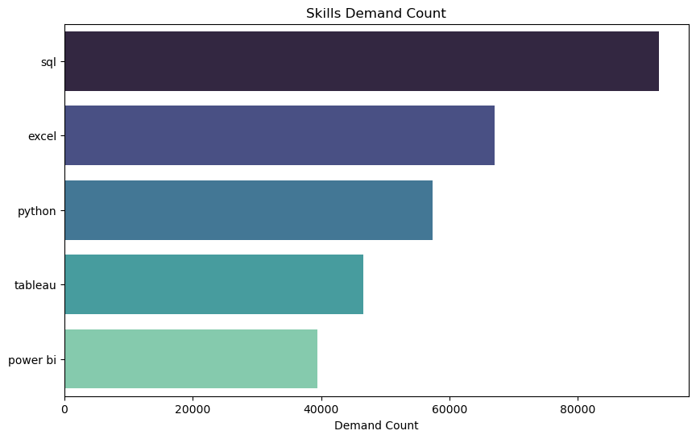
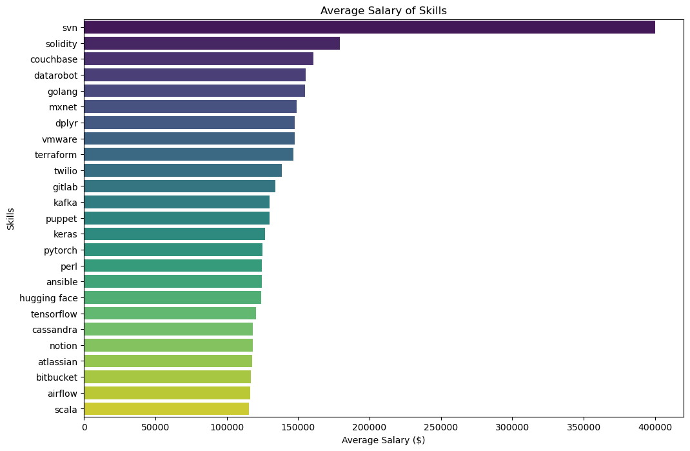
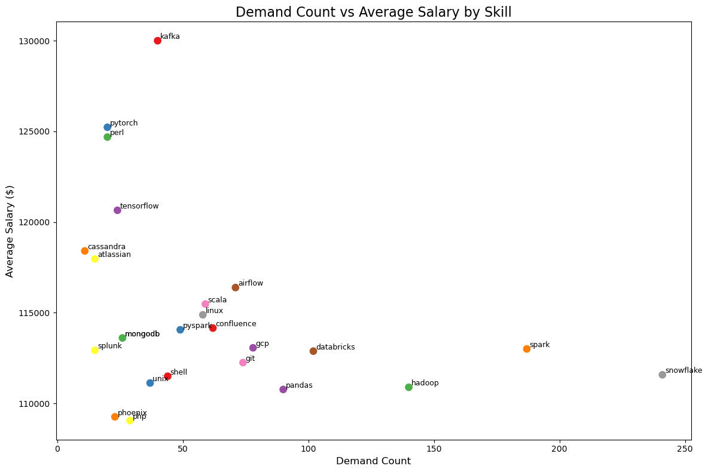

# Introduction
Dive into the data job market! Focusing on the top paying jobs, top paying skills, and which skills people shoud be learning with optimality considered.

SQL queries? Check them out here:  [project_sql folder](/Project_SQL/)

# Background
Driven by the a question to find the top-paid and in-demand skills, making it easier for others to view the skills they may need to learn for higher salaries.

Data hails from the [SQL Course](https://lukebarousse.com/sql). It's packed with insights on job titles, salaries, locations, and essential skills.

### The questions this investigation answers:

1. What are the top-paying data analyst jobs?
2. What skills are required for these top-paying jobs?
3. What skills are most in deamnd for data analysts?
4. Which skills are associated with higher salaries?
5. What are the most optimal skills to learn?

# Tools I used
For the examination of the data analyst job market, the tools used were as follows:

- **SQL:** The backbone of the analysis, allowing the quering of the database and present critical insights.
- **PostgreSQL:**** The chose database management system, ideal for handling the job postings data.
- **Visual Studio Code:** Database management and executing SQL queries.
- **Git & Github:** Essential for version control and sharing SQL scripts, making it available for the public to view and collaboration with peers.

# The Analysis

Each query for this project aimed at investiating specific aspects of the job market.
Here's the approachment method for each question:

### 1. Top Paying Data Analyst Jobs
To identify the top 10 highest-paying Data Analyst roles that are available remotely. Focuses on job postings with specified salaries. Highlighting the top-paying opportunities for Data Analysts, offering insights into employment.

```sql
SELECT
    job_id,
    job_title,
    job_location,
    job_schedule_type,
    salary_year_avg,
    job_posted_date,
    name AS company_name
FROM
    job_postings_fact
LEFT JOIN company_dim ON job_postings_fact.company_id = company_dim.company_id
WHERE
    job_title_short = 'Data Analyst' AND
    job_location = 'Anywhere' AND
    salary_year_avg IS NOT NULL
ORDER BY
     salary_year_avg DESC
LIMIT 10;
```
Here's the breakdown of the top data analyst jobs in 2023 (ChatGPT generated results):

- **Extreme Salary Outlier** – The highest-paying job in the dataset, a Data Analyst role at Mantys, offers an **exceptionally high salary of $650,000**, which is nearly double the second-highest salary. This could indicate a unique compensation structure, an executive-level role mislabeled as a "Data Analyst," or an outlier worth investigating further.  

- **Director & Principal Roles Dominate Top Salaries** – Many of the highest-paying positions are **Director or Principal Data Analyst roles**, such as those at Meta, SmartAsset, and AT&T, with salaries well above $180,000. This suggests that **senior-level positions significantly outpace standard data analyst salaries**, making career advancement crucial for maximizing earnings.  

- **Variation Across Companies** – While companies like SmartAsset and UCLA Healthcare offer competitive salaries, **top-paying roles are spread across different industries**, from **finance (SmartAsset) and healthcare (UCLA) to social media (Pinterest) and telecommunications (AT&T)**. This highlights the broad demand for data analysts across sectors, with salaries varying based on industry, experience, and company size.  


*Bar graph visualizing the salary for data analysts; Generated with the help of ChatGPT*

### 2. Skills for Top Paying Jobs
In addition to using the top 10 highest-paying Data Analyst jobs from first query we added the specific skills required for these roles Why? because it provides a detailed look at which high-paying jobs demand certain skills, helping job seekers understand which skils to develop that align with top salaries.

```sql
WITH top_paying_jobs AS (
    SELECT
        job_id,
        job_title,
        salary_year_avg,
        name AS company_name
    FROM
        job_postings_fact
    LEFT JOIN company_dim ON job_postings_fact.company_id = company_dim.company_id
    WHERE
        job_title_short = 'Data Analyst' AND
        job_location = 'Anywhere' AND
        salary_year_avg IS NOT NULL
    ORDER BY
        salary_year_avg DESC
    LIMIT 10
)

SELECT 
    top_paying_jobs.*,
    skills
FROM top_paying_jobs
INNER JOIN skills_job_dim ON top_paying_jobs.job_id = skills_job_dim.job_id
INNER JOIN skills_dim ON skills_job_dim.skill_id = skills_dim.skill_id
ORDER BY
    salary_year_avg DESC;
```
Here's the breakdown of the top paying skills in the Data Analyst market for 2023 (ChatGPT generated results):

- **High Demand for SQL and Python Skills**: Across all the job postings, **SQL** and **Python** appear most frequently as the required skills. This indicates that these two skills are highly sought after for roles in data analysis and insights, with positions like "Associate Director - Data Insights" at AT&T, and "Principal Data Analyst" at SmartAsset consistently listing both as key skills.

- **Salary Trends Based on Job Title**: The average salary for higher-level roles (e.g., **Associate Director**, **Director**) tends to be higher compared to data analyst roles. For example, the **Associate Director - Data Insights** at AT&T offers an average salary of $255,829, whereas positions like **Data Analyst** at Pinterest and Uclahealthcareers range from $217,000 to $232,000. This suggests that job titles with more responsibilities and leadership roles offer higher compensation.

- **Common Skills for Data Analyst and Insights Roles**: Many roles across different companies require a combination of tools for data visualization and analysis, including **Tableau**, **Power BI**, **Excel**, and **Pandas**. These tools are frequently listed across different positions, regardless of the company or specific job role. For example, the **Data Analyst** roles at Pinterest and SmartAsset require Tableau, while higher-level roles also demand cloud and big data technologies like **AWS**, **Azure**, and **Snowflake**, pointing to the importance of modern, scalable data technologies in advanced data roles.


*Bar graph visualizing the most common skills in the highest paying data analyst jobs; Generated with the help of ChatGPT*

### 3. Top Demanded Skills
We wanted to join job postings to inner join a table similar to query 2, in order to identify the top 5 in-demand skills for a data analyst. Why? To retrieve the top 5 skills with the highest demand in the job market, providing insights into the most valuable skills for job seekers.

```sql
SELECT 
    skills,
    COUNT(skills_job_dim.job_id) AS demand_count
FROM job_postings_fact
INNER JOIN skills_job_dim ON job_postings_fact.job_id = skills_job_dim.job_id
INNER JOIN skills_dim ON skills_job_dim.skill_id = skills_dim.skill_id
WHERE
    job_title_short = 'Data Analyst'
GROUP BY
    skills
ORDER BY
    demand_count DESC
LIMIT 5;
```
Here's the breakdown of the most in demand skills in data analyst jobs (ChatGPT generated results):

- **SQL is the Most In-Demand Skill**: With a demand count of 92,628, SQL is the most requested skill among the listed skills, indicating its critical role in data-related positions.
- **Excel and Python Follow**: Excel (67,031) and Python (57,326) are the second and third most in-demand skills, showing their importance in roles involving data analysis, reporting, and automation.
- **Power BI is Growing**: Power BI has a demand count of 39,468, which is the lowest among the listed skills. This might indicate that it is still growing in demand compared to more established tools like Excel and Tableau.


*Bar graph visualizing the top five skills demanded for data analyst jobs; Generated with the help of ChatGPT*

### 4. Top Paying Skills

We wanted to look at the average salary associated with each skill for Data Analyst positions and focuses on roles with specified salaries, regardless of location. Why? It reveals how different skills impact salary levels for Data Analysts and helps identify the most financially rewarding skills to acquire or improve

```sql
SELECT
    skills,
    ROUND(AVG(salary_year_avg), 2) AS avg_salary
FROM job_postings_fact
INNER JOIN skills_job_dim ON job_postings_fact.job_id = skills_job_dim.job_id
INNER JOIN skills_dim ON skills_job_dim.skill_id = skills_dim.skill_id
WHERE
    job_title_short = 'Data Analyst'
    AND salary_year_avg IS NOT NULL
GROUP BY
    skills
ORDER BY
    avg_salary DESC
LIMIT 25;
```
Here's the breakdown of the highest paying skills in data analyst jobs (ChatGPT generated results):

- **Highest Average Salary**: The highest-paying skill is **SVN** with an average salary of $400,000. This stands significantly higher than other skills, making it an attractive option for high-paying job opportunities.
   
- **Emerging Technologies with High Salaries**: **Solidity** and **Couchbase** come in at $179,000 and $160,515, respectively. These technologies are associated with blockchain and modern database management systems, indicating a rising demand for expertise in these fields.

- **Popular Data Science & DevOps Skills**: Skills like **TensorFlow** ($120,646.83), **PyTorch** ($125,226.20), **Keras** ($127,013.33), and **Kafka** ($129,999.16) represent high-demand skills in data science, machine learning, and DevOps, showing their growing importance in the tech industry.


*Bar graph visualizing the top skills in terms of pay for data analyst jobs; Generated with the help of ChatGPT*

### 5. Most Optimal Skills

We wanted to identify skills in high demand associated with high average salaries for Data Analyst roles. Concentrating on any positions with specified salaries Why? Targets skills that offer job security (high demand) and financial benefits (high salaries), offering strategic insights for career development in data analysis.

```sql
WITH skills_demand AS (
    SELECT 
        skills_dim.skill_id,
        skills_dim.skills,
        COUNT(skills_job_dim.job_id) AS demand_count
    FROM job_postings_fact
    INNER JOIN skills_job_dim ON job_postings_fact.job_id = skills_job_dim.job_id
    INNER JOIN skills_dim ON skills_job_dim.skill_id = skills_dim.skill_id
    WHERE
        job_title_short = 'Data Analyst'
        AND salary_year_avg IS NOT NULL
    GROUP BY
        skills_dim.skill_id
), average_salary AS (
    SELECT
        skills_job_dim.skill_id,
        ROUND(AVG(salary_year_avg), 2) AS avg_salary
    FROM job_postings_fact
    INNER JOIN skills_job_dim ON job_postings_fact.job_id = skills_job_dim.job_id
    INNER JOIN skills_dim ON skills_job_dim.skill_id = skills_dim.skill_id
    WHERE
        job_title_short = 'Data Analyst'
        AND salary_year_avg IS NOT NULL
    GROUP BY
        skills_job_dim.skill_id
)

SELECT
    skills_demand.skill_id,
    skills_demand.skills,
    demand_count,
    avg_salary
FROM
    skills_demand
INNER JOIN average_salary ON skills_demand.skill_id = average_salary.skill_id
WHERE
    demand_count>10
ORDER BY
    avg_salary DESC,
    demand_count DESC
LIMIT 25;
```
Here's the breakdown of the most optimal skills in data analyst jobs (ChatGPT generated results):

- **Top Skills by Demand**: The most in-demand skill in this dataset is **Snowflake** with a demand count of **241**, significantly higher than others. This indicates that Snowflake is currently highly sought after in the job market.

- **High Salary but Lower Demand**: **Kafka** stands out with an average salary of **$129,999.16** but has a demand count of only **40**. This shows that while Kafka may offer high compensation, it may not be as commonly requested as other skills like Snowflake or Hadoop.

- **Balanced Skills**: Skills like **Pandas** (**90 demand**) and **Git** (**74 demand**) have moderate demand while maintaining relatively high average salaries (**$110,767.07** and **$112,249.64**, respectively). These skills seem to strike a balance between market demand and salary, making them solid choices for professionals seeking both growth and compensation.


*Bar graph visualizing the most in demand and highest paying skills; Generated with the help of ChatGPT*
# What I learned

Throughout this project, I improved my SQL skills by:

- Generating some of my first SQL Queries outside of the platform SQLite. It's amazing to see how much you learn just in terms of settings up the enviroment and importing the tables into VSCode. It is truly totally customizeable and there doesn't seem like there's that much of a limit in the eyes of a beginner.

- Editing my SQL queries with the various error codes that would be outputted my the console was very annoyhing, however, it proved to be valuable in specifically telling me what was wrong. Also seeing and generating the tables allowed to me to take those results and transform them into graphs by going into to python. Its beyond amazing what you can do.

# Conclusion

### Main Insights:
Certainly! Here are the condensed answers to your questions:

1. **What are the top-paying data analyst jobs?**
   - The highest-paying data analyst jobs are **Director** and **Principal Data Analyst** roles, such as those at **AT&T** and **Meta**, with salaries above $180,000. An outlier position offers **$650,000** at Mantys. Senior roles tend to command the highest compensation.

2. **What skills are required for these top-paying jobs?**
   - Top-paying jobs require expertise in **SQL**, **Python**, and advanced tools like **AWS**, **Snowflake**, and **Tableau**. Senior roles also demand proficiency in **big data** technologies and **machine learning** tools like **TensorFlow** and **PyTorch**.

3. **What skills are most in demand for data analysts?**
   - The most in-demand skills are **SQL**, **Excel**, and **Python**, with **Tableau** and **Power BI** also frequently requested. **Snowflake** is highly demanded, with **Power BI** still growing in demand.

4. **Which skills are associated with higher salaries?**
   - **SVN** ($400,000), **Solidity** ($179,000), and **Couchbase** ($160,515) are the highest-paying skills. **Kafka**, **PyTorch**, and **Keras** also command high salaries in data science and DevOps roles.

5. **What are the most optimal skills to learn?**
   - **SQL** and **Python** are essential for most data roles. Learning **Tableau**, **Pandas**, and **Snowflake** provides a solid balance of demand and salary. For high-paying opportunities, focus on **TensorFlow**, **PyTorch**, and **Kafka**.

### Closing Thoughts

This project has enhances my SQL skills and provided valuable information into the data analyst job market. The results definitely stunned me it seems like the more specialized skills paid way more then the most demanded skills, although now that I type it seems obvious. Aspiring data analyst can better position themsleves in a competitive market by learning the most in demand skills and maybe a skill or two of the specialized ones.